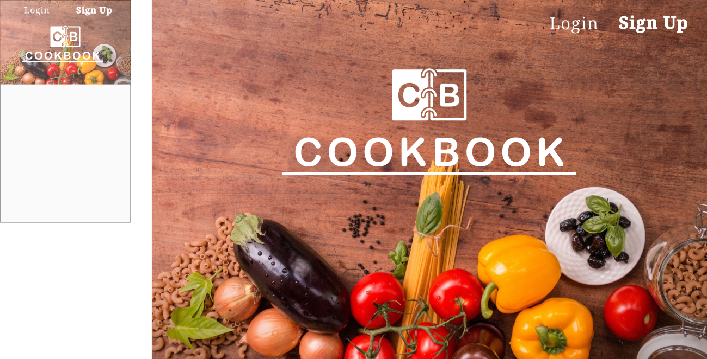

Lambda Labs Sprint Challenge 1 for Cookbook project.

# Part 1 - Individual Accomplishments this Week

**Github Handle: Bradiowave**

This week I mainly focused on front-end and did a bit of work on the back-end in order to understand the workings of the entire project. On Monday, the team decided on the best stack to use for our project and why. My job was to research SQL vs noSQL, and I decided that a SQL database offers the most advantages in our project since many users would share the same recipes, so it makes sense to make references to recipes using the relationships of a SQL database. We initialized our github project on Tuesday and figured out a workflow that would help everyone contribute to the project. Katie and I worked on creating Mockups for the Signin, Signup, and LandingPage components that we could reference when working on the functionality and styling of each component. These proved to be useful on Wednesday night and Thursday morning when I created the Signin and Signup components and styled it according to the mockup. Later on Thursday, I completed the week by adding instructions and ingredients models to prisma on the back-end. 

## Tasks Pulled
### Front End
- Ticket 1
    - Github: Lambda-School-Labs/Labs8-Cookbook: Pull Request 11
    - Trello: https://trello.com/c/UekXSiqc/29-signup-signin-mockup
- Ticket 2
    - Github: Lambda-School-Labs/Labs8-Cookbook: Pull Request 13
    - Trello: https://trello.com/c/300ydBX4/34-signup-component-styling
- Ticket 3
    - Github: Lambda-School-Labs/Labs8-Cookbook: Pull Request 15
    - Trello: https://trello.com/c/q1WYECKc/24-signin-component-styling
### Back End
- Ticket 1
    - Github: Lambda-School-Labs/Labs8-Cookbook: Pull Request 19
    - Trello: https://trello.com/c/YOC6wWAp/42-instruction-and-ingredient-prisma-models

## Detailed Analysis
For ticket 1 on the front end, I created mockups for the Signup, Signin, and LandingPage components. I also created a Cookbook logo that will be used on the navigation bar to direct to the home page throughout the site. I used Inkscape, a free and open source vector graphics tool, to create the mockups and logo. It was important to make the logo a scaleable vector graphic so that it would look good at any size. 

We want our app to be mobile friendly, so I started each mockup with how it should look on mobile and then created the desktop version with the same assets. That way our app will look similar on both devices without just being a scaled version of the other, and ending up looking too small or large on one type of device. The landing page mockup is pretty simple. It has a nice looking background image that alludes to the purpose of our app, with the name and logo of the site in the center. I put emphasis on `Sign Up` link since those who are on the landing page will likely not have an account. The purpose of that page is to sell our product, so we want to make it easy for new users to get started.

The Sign Up page is similarly simplistic. The are several input fields that are required for users to make an account with us.There’s a link near the top of the page for users that already have an account. New users have the option to buy a premium membership with us to get access to special features. There is nothing in the nav-bar besides our logo because new users don’t have access to the features of our app yet. The logo directs to the landing page in case users would like to learn more about the site before registering.

# Part 2 - Milestone Reflections
I have never worked on a team before to develop an app, so starting this team workflow in labs was definitely a challenge. Creating branches, getting approval for pull requests, keeping a trello board up to date with what is being worked on, it’s a lot to keep up with when working on a team project. Now that I’ve had a week with this workflow however, I can see why every step is necessary to keep our main code functional. All team members must work on separate parts of the project in separate branches so that there are no conflicts while merging. My group has been great with dividing up the work so that everyone is putting in an equal effort. We have accomplished a lot this first week because of everyone’s cooperativeness. Katie and I have mainly worked on the front end this week, while Arthur and Vu focused on the back end. We all played to our strengths this week to get the project up and running quickly, but we also made sure to meet as a team to plan out the daily work schedule and catch eachother up on the inner workings of the front or back end. A majority of the week was spent in zoom meetings, either for pair programming or for discussing and planning the project. When working as a team, it’s important to meet in person and communicate about the project so that everyone is on the same page. We didn’t really have any problems with one another in the group. Everyone is respectful and gives others a chance to talk, as well as giving accurate criticisms and ideas. We always come up with a plan in the morning and stick to it. No one works on a part of the project without getting permission first. If one person needs to change another’s work, he or she will ask for permission as well. At the end of the day, we all meet in a final zoom meeting and discuss what we have worked on. Each person explains what additions or changes they have made to the project so that everyone is up to date and knows the project inside and out.

**Deployed Front End:** http://lambda-cookbook.netlify.com/

**Deployed Back End:** https://lambda-cookbook.herokuapp.com/

**Proof of Authenticated User Account:** https://trello-attachments.s3.amazonaws.com/5be072f2afaae80c3eb430d3/5be30d52c4c15f3022f181b8/a00c4b406b8ca0768cfe9952b5dcacef/a170325efe3a06203e3b467d6d644ec4.png
