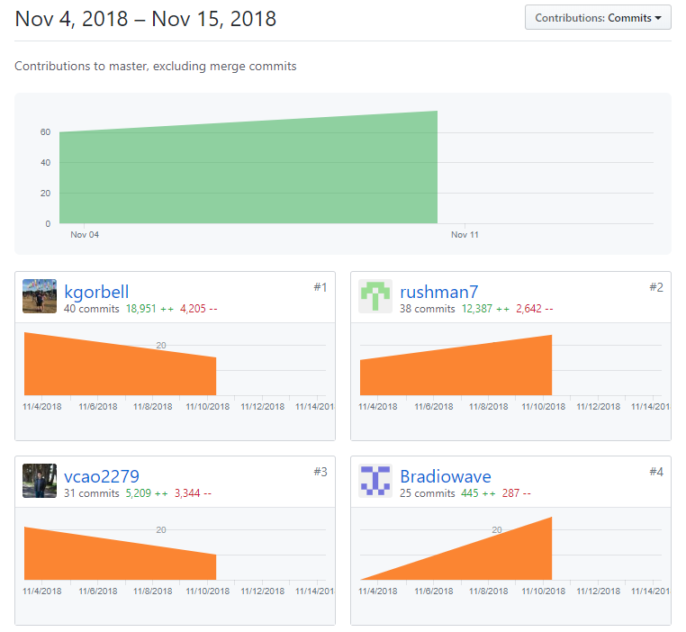
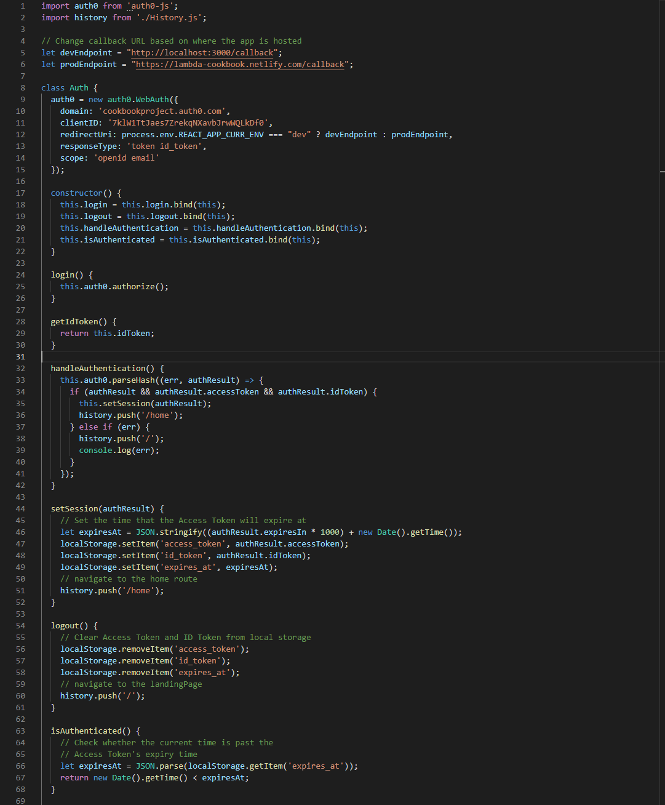
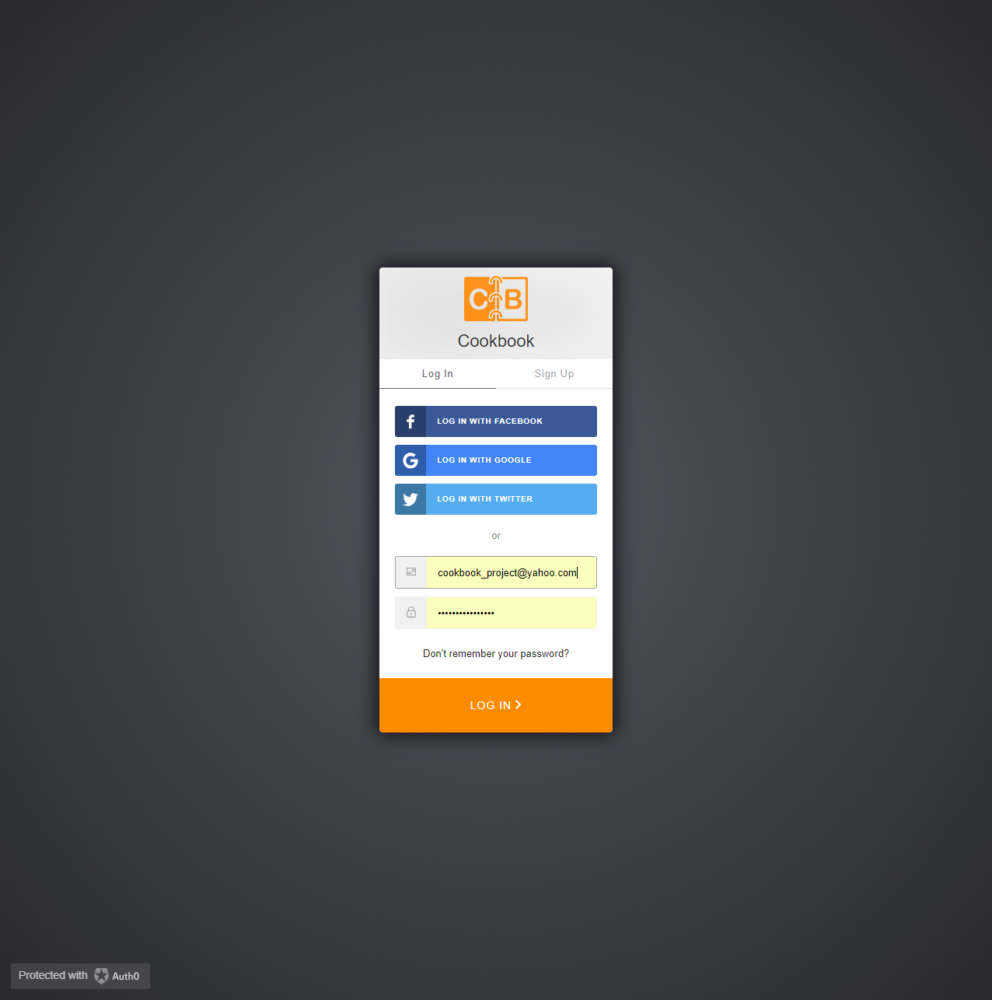
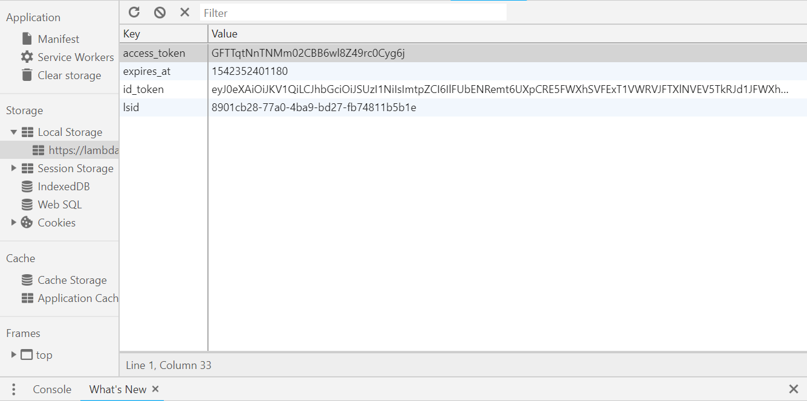

Lambda Labs Sprint Challenge 2 for Cookbook project.

# Part 1 - Individual Accomplishments this Week

**Whiteboard Interview:** https://www.youtube.com/watch?v=YUEzpH8cuHo

**Github Handle: Bradiowave**

The week started out strong on Tuesday when I integrated 3rd party authentication with Auth0. I set it up along with some styling to match the rest of our website, but the UI to reach the sign in prompt wasn’t great. I worked on Wednesday to fix up the UI dealing with signing in and out with Auth0. Users that are not signed in will always start on the landing page, and once a user is signed in he or she will be directed to the home page of our app so they can start using it. I finished wednesday by fixing some bugs on our netlify deployment where it would throw a 404 error after signing in. Thursday was spent connecting a signed-in user’s id_token from Auth0 to our groups personal cookbook database. I had worked mainly on front-end last week, so I had to spend much of my time on Thursday learning about GraphQL and Prisma so I could rework some parts of the back-end. There are still errors I need to fix before Friday, but the basic logic is that the client will send the id_token to our server, the server will decode the token and check for the user id in our database, and will send back a response telling us if the user is new or not.

## Tasks Pulled
### Front End
- Ticket 1
    - Github: https://github.com/Lambda-School-Labs/Labs8-Cookbook/pull/23
    - Trello: https://trello.com/c/Yytpv9BY/48-implement-3rd-party-authentication-auth0-or-passport-etc
- Ticket 2
    - Github: https://github.com/Lambda-School-Labs/Labs8-Cookbook/pull/25
    - Trello: https://trello.com/c/ljwdXv9p/53-get-redirects-working-in-netlify-and-fix-signin-out-ui
- Ticket 3
    - Github: https://github.com/Lambda-School-Labs/Labs8-Cookbook/pull/31
    - Trello: https://trello.com/c/0qfzED2R/61-env-rework

### Back End
- Ticket 1
    - Github: https://github.com/Lambda-School-Labs/Labs8-Cookbook/pull/35
    - Trello: https://trello.com/c/uuE6A2nz/54-parse-the-auth0-idtoken-to-store-the-user-id-in-our-database

## Detailed Analysis
The biggest feature that I implemented this week was third party authentication in ticket 1 of the front end. I used Auth0 because it provides a universal login across all platforms, and allows users to sign in with accounts like Facebook, Google, and Twitter. They also provide a nice step-by-step guide for integrating auth0 into a single page react application. After registering and initializing the cookbook project on the auth0 website, I could install the auth0-js library in the react app and bring it in as a script. After that, I created a service in the Auth.js file where I could create an instance of the auth0.WebAuth object and use that to authorize and check for authentication with the tokens that come back from Auth0.

Most of the work was complete at that point, I just needed to make it possible for users to reach the sign in page from our app. I repurposed the Signin component to have a button that would send the user to our Auth0 login/sign up page. The UI wasn’t ideal, but I would change it later in ticket 2. Now that our app was linked to the Auth0 signin form, users could reach a page that looks like this.

There was one last step to make the website fully navigable. After users sign in, they needed to be redirected to our app. The Auth0 object takes a redirectUri as a parameter, so I created a new callback endpoint to handle that. The callback endpoint displays a loading screen, but it also handles authentication and places the tokens that it receives from auth0 into local storage. Once the tokens are in local storage, the /home route displays and authenticated users can start using our website!

# Part 2 - Milestone Reflections
In order for our group to meet the MVP requirements of connecting the front end and back end, allowing users to sign in through Auth0, and connecting to a couple of APIs, we divided up the work but met frequently enough in order to make sure each part worked together. My week was largely dedicated to integrating Auth0 into our project, and since it acts as a kind of middleware I didn’t have to change much of our predefined codebase. I had it working pretty quickly where the user would click the sign in button and be taken to our Auth0 sign in website that is separate from the cookbook app. Once I had the sign in working, I needed to start collaborating with my other group members to finish the authentication process. After a user signs in, I needed to match their Auth0 id with an id in our user database in order to connect users to their cookbook accounts. I worked with Vu to store user information on the GraphQL server context which is available to all queries and mutations. I then reworked the Signup mutation to create a new user and link the Auth0 id to the user id in our cookbook database. Katie and Arthur were relying on that feature so that they could connect their APIs to a user. Katie worked on Stripe payments, and needed to connect a user that just bought a subscription to their id in the database. Arthur did something similar with the calendar since he needed to display the schedule of each specific user.

**Front and Back End Servers Connected:** Front end can view recipes from our database
https://lambda-cookbook.netlify.com/home/recipes

**Users Can Create Accounts:** https://cookbookproject.auth0.com/login?state=g6Fo2SBTUFFDNTkyMVgxUkE1NDNjSUdYcjlmWWZkQTh5UEZYX6N0aWTZMmdhRm8yU0J2TmtRNVZtWlBibFZKUmtsSldFUlRPRmQwY25oMGFsOU9jemxWUkRoMlJBo2NpZNkgN2tsVzFUdEphZXM3WnJla3FOWGF2Ykpyd1dRTGtEZjA&client=7klW1TtJaes7ZrekqNXavbJrwWQLkDf0&protocol=oauth2&response_type=token%20id_token&redirect_uri=https%3A%2F%2Flambda-cookbook.netlify.com%2Fcallback&scope=openid&nonce=fM7CuYcgqBAGneRIC4ELpccIbvXwKXl~&auth0Client=eyJuYW1lIjoiYXV0aDAuanMiLCJ2ZXJzaW9uIjoiOS44LjIifQ%3D%3D

**APIs and Services Working:** https://lambda-cookbook.netlify.com/home/settings
https://lambda-cookbook.netlify.com/home/calendar
