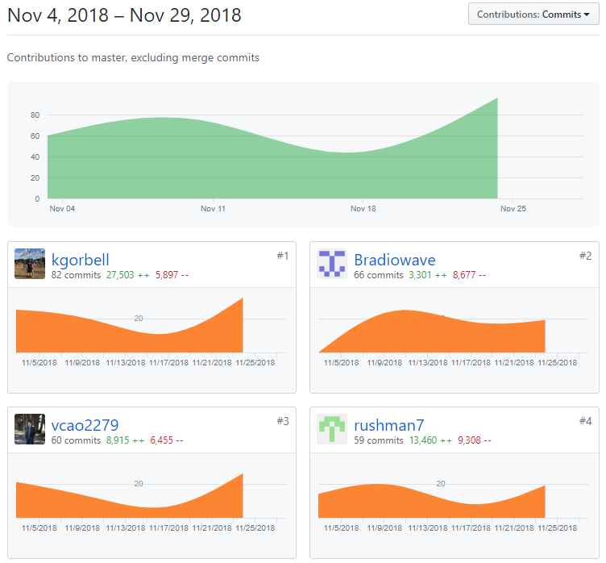
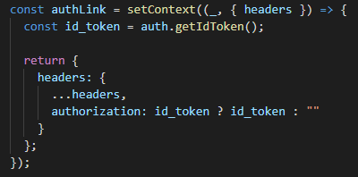
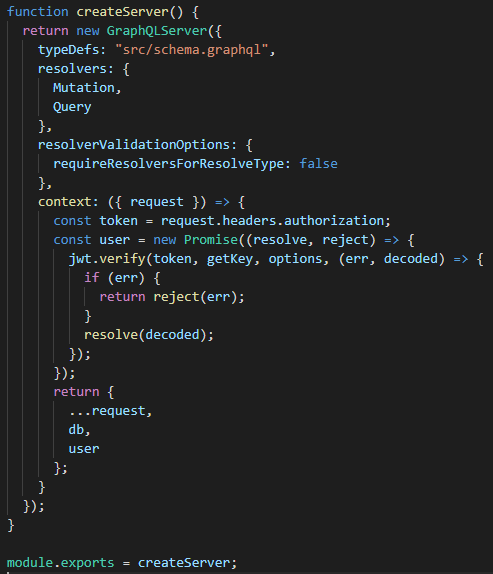
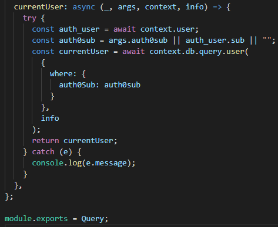

Lambda Labs Sprint Challenge 3 for Cookbook project.

# Part 1 - Individual Accomplishments this Week

**Whiteboard Interview:** https://www.youtube.com/watch?v=6fXj4gE2pIk&feature=youtu.be

**Github Handle: Bradiowave**

This week’s MVP of making our app feature complete was a tough one with many challenges, and my team and I made a lot of progress because of it. The first challenge I worked on was parsing the token from Auth0 in our back end so we could connect our Auth0 users to our app. I placed the `id_token` from Auth0 into the header through Apollo client, decoded the token with `javascript-web-tokens` in our server, and set that decoded user information on the context of our server so it could be accessed at each mutation and query. The next challenge I worked on was adding a way for users to schedule a recipe for a day of their choosing. This was pretty easy to do with a component called `DatePicker`, which prints out a human readable date in the app, but stores a Date object in the component state. Now that we had all of the necessary recipe and event data from the user, our team needed to write mutations to store that data in our database. I wrote the instructions and ingredients mutations, which loop through their corresponding arrays and relate each ingredient or instruction to the recipe. At first we tried to nest mutations so that our instructions and ingredients mutations would have access to the newly-created recipe, but this proved to be difficult and cumbersome. We refactored the code so that each mutation wraps around the component and can be accessed anywhere in the Create component. Now that users could add recipes and events to our database, we wrote queries to retrieve the appropriate data for each component and display it.

## Tasks Pulled

### Front End

- Ticket 1
    - Github: https://github.com/Lambda-School-Labs/Labs8-Cookbook/pull/39
    - Trello: https://trello.com/c/IRClV4AI/27-component-mockups

- Ticket 2
    - Github: https://github.com/Lambda-School-Labs/Labs8-Cookbook/pull/44
    - Trello: https://trello.com/c/a7EHG13T/74-day-picker

- Ticket 3
    - Github: https://github.com/Lambda-School-Labs/Labs8-Cookbook/pull/50
    - Trello: https://trello.com/c/4EMaRB03/75-recipes-component-basic-functionality

### Back End

- Ticket 1
    - Github: https://github.com/Lambda-School-Labs/Labs8-Cookbook/pull/38
    - Trello: https://trello.com/c/3y0p5ePD/68-parse-the-auth0-idtoken-to-store-the-user-info-on-context

- Ticket 2
    - Github: https://github.com/Lambda-School-Labs/Labs8-Cookbook/pull/55
    - Trello: https://trello.com/c/f6Yzh6WK/79-add-instructions-and-ingredients-mutations-to-create-page

## Detailed Analysis (Back End Ticket 1)
	The first ticket that I worked on this week was also one of the most interesting. I needed a way to connect our database to users that sign in through our 3rd party authentication site Auth0. The only connection that our cookbook app has with Auth0 after a user signs in is a token that stores the user’s information. We want to decode that token in the back end so that attackers can’t retrieve raw, open data from the front end. I set up the `authLink` function for ApolloClient to get the token from Auth0 and send it through headers on every request.

The back end server now needs to be set up to decode the token and set the user information on the server context. I assign the token to what comes from `headers.authorization` and pass it to the `jwt.verify` function along with options specific to our admin Auth0 account to decode the token. Once the token is verified, the promise returns the decoded user info and returns that for the server context.

Finally, I could use that context in a query to return the user that is currently signed in. I get the user from the server context that was passed into the function as an argument. I can then pull off the subscription from the user, and run a query where the user subscription from the token on headers matches the one in our database. This proves that we can see who is currently signed in to our app, and any time the user makes a request to view or edit data we can tie it to their account.

# Part 2 - Milestone Reflections
Making our app feature complete has been the most challenging labs week so far. My team needed to split up the work and communicate a lot in order to get everything working and reach MVP. Most of our components display information that the user has input over time, such as all of their recipes and the dates on which they are scheduled. We didn’t have our front end completely connected to our back end in the beginning of the week, so we decided that one person would work to connect the front end to the server to persist our data, while the others would build out React components using dummy data. That way we could all work on functionality and make a lot of progress without having to wait on each other to finish. Once we were able to save a user’s recipes and events to our database, all we had to do for each component was fetch the database data and use that instead of our dummy data. The overall approach to the week was simple, but making making sure everything and everyone worked together was more complicated. We held zoom meetings often to divide up the work and check on everyone’s progress. We pair programmed a lot so everyone would know how each major piece of code worked. We also rotated responsibilities so that each member would have a chance to work on both the front end and back end. Even though we divided up the work to reach MVP, the team was in constant communication in order to bring all of the disparate components together into a cohesive application.

**Sign in Page:** https://lambda-cookbook.netlify.com/
(You must sign in for these pages to work)
**Create Page:** https://lambda-cookbook.netlify.com/home/create
**Recipes Page:** https://lambda-cookbook.netlify.com/home/recipes
**Singular Recipe Page:** Click on a recipe card
**Calendar Page:** https://lambda-cookbook.netlify.com/home/calendar
**Grocery List Page:** https://lambda-cookbook.netlify.com/home/dashboard
