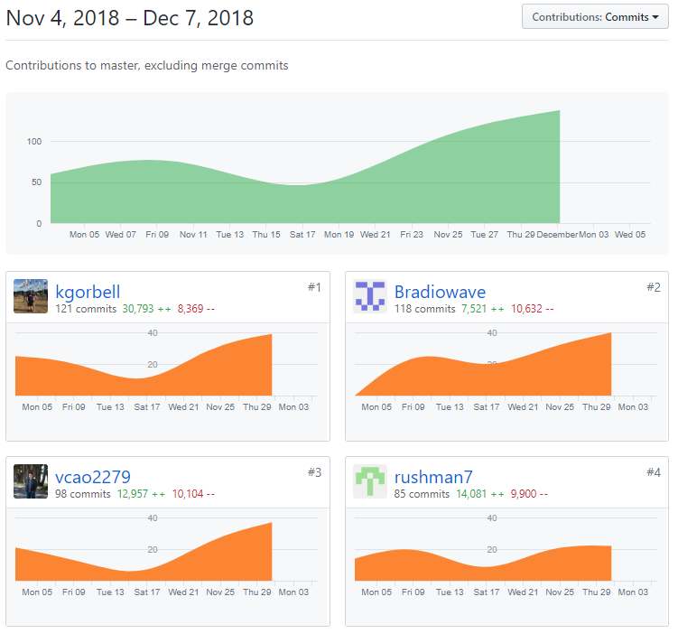
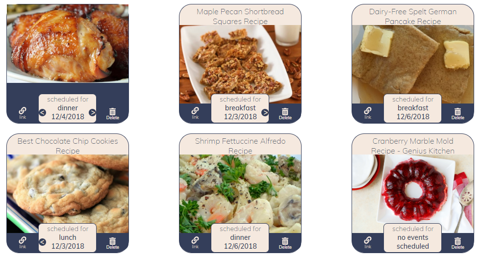
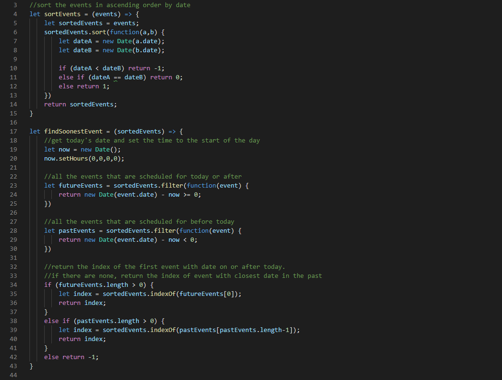
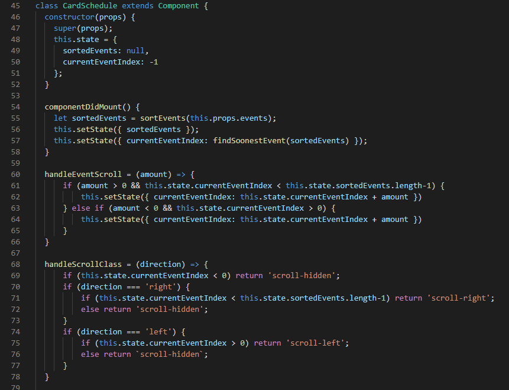

Lambda Labs Sprint Challenge 4 for Cookbook Project.

# Part 1 - Individual Accomplishments this Week

**Whiteboard Interview:** https://www.youtube.com/watch?v=DMztaxFC5Yk&feature=youtu.be

**Github Handle: Bradiowave**

This week focused mostly on front end styling and tweaking the code to make it as user friendly as possible. I worked on a few functionality fixes, but mostly focused on reworking the mockups for our site and applying those styles to the CSS. It was much more difficult than I thought it would be, mostly because I had to style components that I didn’t work on. In order to match the mockups, different parts of a component need to be in certain divs. And each part needs to be in the correct order. I had to rearrange elements in each component and test it to make sure that I hadn’t broken anything. The calendar component came from a third party library, so I could only work with the CSS for that component, which proved to be difficult. I needed to copy the CSS from the library into our project, and figure out how it was structured in order to properly change it. Another challenge was that we didn’t have a meeting with Bri until the middle of the week. Our group had to rework some of the styling after the meeting and make sure that it still looked good. I tweaked the mockups so we still had a reference to go off of, but we didn’t have much time to make too many changes at that point.

## Tasks Pulled

### Front End

- Ticket 1
    - Github: https://github.com/Lambda-School-Labs/Labs8-Cookbook/pull/64
    - Trello: https://trello.com/c/e0SNhmRu/87-responsive-footer-styling

- Ticket 2
    - Github: https://github.com/Lambda-School-Labs/Labs8-Cookbook/pull/67
    - Trello: https://trello.com/c/dkS0oqrh/92-responsive-header-styling

- Ticket 3
    - Github: https://github.com/Lambda-School-Labs/Labs8-Cookbook/pull/79
    - Trello: https://trello.com/c/kw6tvAni/98-style-create-page-with-mobile-first-responsive-design

### Back End

- Ticket 1
    - Github: https://github.com/Lambda-School-Labs/Labs8-Cookbook/pull/69
    - Trello: https://trello.com/c/rkuhGtql/97-make-carousel-out-of-schedules-on-recipe-cards

- Ticket 2
    - Github: https://github.com/Lambda-School-Labs/Labs8-Cookbook/pull/59
    - Trello: https://trello.com/c/nPbW7j0W/86-grocery-list-basic-funcionality

## Detailed Analysis (Back End Ticket 1)
One of the coolest features I worked on this week was making a scrolling carousel out of multiple events of a recipe. Before the fix, all of the scheduled events of a recipe would show in a long list that would flow out of the bounds of its card. The solution was to only show one scheduled event for each recipe at a time, and allow users to scroll between events. We also wanted the initial event shown to be as close to the current date as possible, as well as be on or after the current date. That way the user would know which recipes are coming up the soonest. You can see in the finished result that an arrow only shows if there is an event before or after the one currently in view. If the recipe is not scheduled for any dates, it lets the user know.

In order to get the functionality working, I needed to create a couple of functions to properly format the incoming event data. First I made a pretty simple `sortEvents()` function that takes in the list of events and sorts them by date in ascending order. I fed a custom function into the sort function that returns a positive or negative integer depending on the order of one event in relation to another. The function to find the soonest event was a bit tougher. `findSoonestEvent` takes the sorted events array and filters the future events and past events into separate arrays. It first looks at the future events and returns the first event in that array. If there are no future events, it returns the last event in the past events array since that will be closest to the current date. If there are no events, the function returns `-1` to signify that there are no events for that recipe.

With the functions tested to work properly, I made the `CardSchedule` component and initialize the state by ordering the event array from props and finding the soonest event. I also added the `handleEventScroll` method so that the user can only scroll left or right if there is an event to scroll to in that direction. The `handleScrollClass` method handles the class name of the scroll buttons so they only show when the user can actually scroll in that direction.

# Part 2 - Milestone Reflections
The main focus of the sprint this week was the user interface and experience of our app. A vast majority of our time was spent on the front end since our back end was already in place. The front end is also the only part of the app that the user interacts with, so we had to focus on component functionality and styling. Just like past weeks, my group divided up the work and met often so that we were all on the same page. Katie and I focused our efforts on CSS styling, while Vu and Arthur focused on functionality and bug fixes. We made sure to swap duties around a bit so that we all had experience with each part of the code as well. The biggest challenge with working as a team this week was that one part of CSS can affect another. There isn’t an easy way to separate styling for each page. Sometimes I would make a change that I thought would only affect the page I was working on, but it would end up having an unforeseen consequence in another part of the app. CSS can also be pretty finicky and behave unexpectedly. I tried to stick with flexbox for everything that I styled, but I ran into a blocker when I had to change the styling for a third party calendar component that used `display: table`. While there is still a good amount of styling to be done over the weekend, our group has made a lot of progress this week in terms of functionality and user experience. 

Here are the links for our app. The styling for a couple of pages still need work, and we need to add some feedback for users for error handling.

**Sign in Page:** https://lambda-cookbook.netlify.com/
(You must sign in for these pages to work)
**Create Page:** https://lambda-cookbook.netlify.com/home/create
**Recipes Page:** https://lambda-cookbook.netlify.com/home/recipes
**Singular Recipe Page:** Click on a recipe card
**Calendar Page:** https://lambda-cookbook.netlify.com/home/calendar
**Grocery List Page:** https://lambda-cookbook.netlify.com/home/dashboard