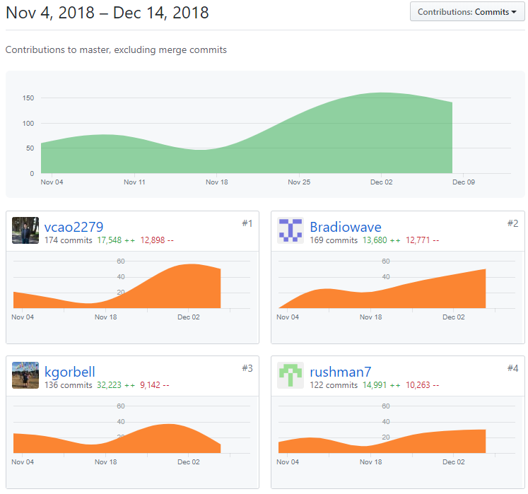
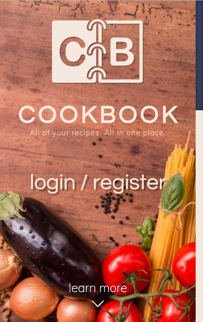
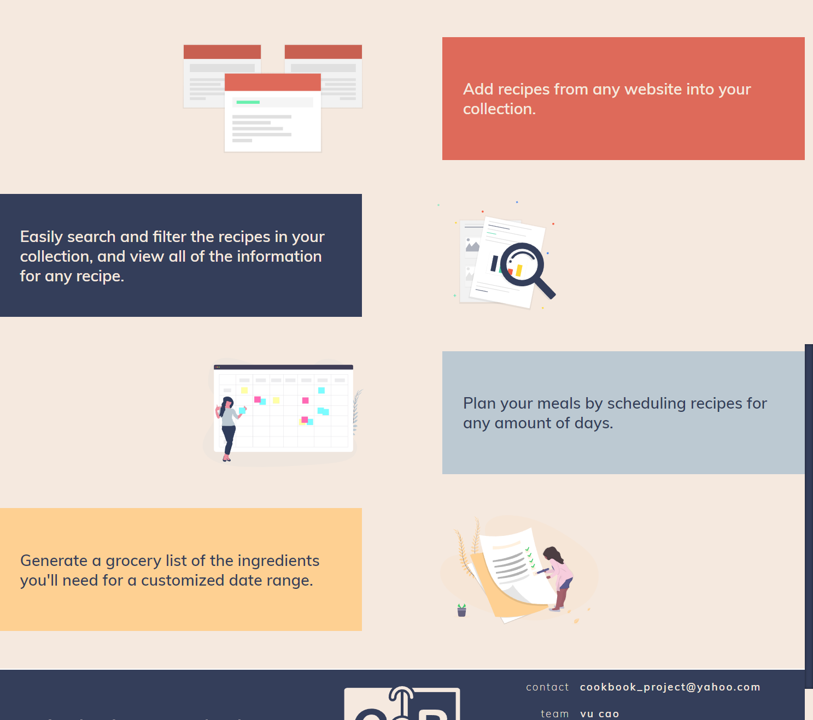

Lambda Labs Sprint Challenge 5 for Cookbook Project.

# Part 1 - Individual Accomplishments this Week

**Github Handle: Bradiowave**

I did a lot of work on the front end this week, with a focus on styling everything to look great with user interface and experience in mind. I started by restyling the create page and the mini calendar to be consistent with the rest of our app. Then I moved on to the landing page. It was a lot of fun to make because I was able to use styling methods that I’d never used before. I used vw (view width) and vh (view height) to set the “above-the-fold” content equal to the size of the viewing window. I also made each letter in “COOKBOOK” a separate element so I could evenly space it across it’s container. After the landing page, I moved on to restyling the recipe cards. The old design had solid background colors and not much padding around elements. The new design looks much cleaner with a white background and a solid blue border as an accent. There’s also a lot more padding around elements to let it all breathe. From there, I added many small design tweaks and fixes. I fixed the header in mobile view to be clickable. I added instructions to the Add Recipe page and an app-wide loading bar. I made custom checkboxes for the grocery list and single recipe view. Even though they were all small fixes, all the changes really add together to make our app look fantastic!

## Tasks Pulled

### Front End

- Ticket 1
    - Github: https://github.com/Lambda-School-Labs/Labs8-Cookbook/pull/82
    - Trello: https://trello.com/c/epoaa2Fc/118-re-style-create-page-and-mini-calendar

- Ticket 2
    - Github: https://github.com/Lambda-School-Labs/Labs8-Cookbook/pull/90
    - Trello: https://trello.com/c/5cl53pEq/124-style-landing-page

- Ticket 3
    - Github: https://github.com/Lambda-School-Labs/Labs8-Cookbook/pull/92
    - Trello: https://trello.com/c/OcpLGK6c/128-style-recipe-cards-to-match-current-mockup

- Ticket 4
    - Github: https://github.com/Lambda-School-Labs/Labs8-Cookbook/pull/94
    - Trello: https://trello.com/c/32k17tVi/131-fix-header-and-other-things

- Ticket 5
    - Github: https://github.com/Lambda-School-Labs/Labs8-Cookbook/pull/99
    - Trello: https://trello.com/c/9oG2jM4Q/129-loading-bar-and-add-recipe-instructions

- Ticket 6
    - Github: https://github.com/Lambda-School-Labs/Labs8-Cookbook/pull/101
    - Trello: https://trello.com/c/EgrClCez/132-checkbox-styling

### Back End

- Ticket 1
    - Github: https://github.com/Lambda-School-Labs/Labs8-Cookbook/pull/86
    - Trello: https://trello.com/c/9u8GNdEP/13-readme

## Detailed Analysis (Front End Ticket 2)
The landing page was a lot of fun to work on because it hadn’t hardly been styled at all until this polish week. Our group wanted to save it for last so that we could accurately portray our final project to new users. I had designed the above-the-fold portion pretty early on in labs, but we still hadn’t implemented it, so that’s what I started with. I was able to follow the mockup pretty closely. Making it take up the entire screen was pretty easy, I just had to set the container to be 100% width, and 100vh (which is 100% of the view height). It was difficult to figure out how to dynamically scale the image and center it. I tried many different techniques including flexbox and hiding the overflow, but it didn’t work too well. What finally did work was setting the background of the container to the image, and styling it with `background-size: cover;` and `background-position: 25% 50%;`. I set the position to those values so that the image would always be centered vertically, and it would tend towards 25% of the image width when scaling horizontally. I wanted the “login / register” button to sit between the eggplant and noodles to give it some framing.

Once the main portion was finished and responsive, I worked on the below-the-fold portion to give new users some info about our web application. I made sure to follow the color scheme of our website and the specific web pages to train users with colors. I also found some great vector illustrations from https://undraw.co/illustrations that quickly show what our app is about. I was able to change the main color of those illustrations to match our website as well.
.

# Part 2 - Milestone Reflections
Things went pretty well this last week with polishing the website. My team was able to add a lot of finishing touches that really make our website look and function nicely. At the beginning of the week, we created a checklist on a Trello card to keep track of things that we wanted to update in our app. From there, we held zoom meetings to divide up the checklist and make sure everyone knew what to work on. We added a ton of flair including a landing page, instructions on the create page, revamped recipe cards, icons for the meal types, custom checkboxes on the grocery list and instructions list, a universal loading animation, more consistent styling across the website, and subtle animations across the website. My team also didn’t run into many problems despite the 90-90 rule. We were able to add a lot in a short amount of time to polish our website and make it stand out.

**Tech stack**: 
- React.js:
    - Based on **reusable components** to build an entire app
    - Allows each team member to work on a separate component at one time
    - High performance with the **virtual DOM**
    - Powerful **dev tools** for faster debugging
    - Stable future. It’s backed by a **strong company** and has a **large community**
    - **Code is shared** between web and mobile apps

- Apollo Client:
    - Works well with React.js due to use of components
    - **Tracks `loading` and `error` states** automatically so we can easily handle each
    - Comes with an **intelligent cache** out of the box, so data is normalized and consistent across components
    - Apollo Links make the client extensible to accomodate more advanced features.
    - GraphQL Client that sends a query request to server. After server responds it will feed the data back to Apollo which will then pass it back into our frontend client(React).

- LESS:
    - **Variables** keep styling consistent and allow for easy app-wide changes
    - **Mixins** allow styling to be reused and makes code DRY
    - **Nesting** elements greatly organizes code and maximizes readability
    - Values can be calculated with **arithmetic operations**

- GraphQL:
    - GraphQL the identity is separate from how you fetch it, whereas in REST API the endpoint you call is the identity of that object.
    - Useful in our specific project because certain endpoints have different id’s based on recipe or ingredients involved.
    - Can traverse from the entry point to related data while in REST you have multiple endpoints to call to fetch these related data’s. Especially prominent in our project because many recipes will have a common ingredient amongst one another. eg; salt.

- Prisma:
    -  Prisma **supports many of the popular known databases** such as MySQL, MongoDB, PostgreSQL, etc. 
    - Prisma acts as the bridge between all the databases and the backend server, GraphQL. It can access multiple databases simultaneously and simplifies that use by letting the user read and write data to the database using their preferred programming language. 
    - Prisma analyses our database schema and **generates a user-friendly data-model** that can easily generate mutations and queries. 
    - Prisma also turns our DB into a **GraphQL API**.
    - **No boilerplate** for CRUD or filters.

**Description**: With Cookbook, you can save recipes from any website onto your account to view all in one place. Recipes can be scheduled for any number of dates and meal of the day. You can view all information about a recipe including scheduled time, cook time, servings, ingredients, and instructions. Recipes from allrecipes.com and geniuskitchen.com support a checklist for the list of instructions. You can also view a calendar that shows when all of your recipes are scheduled. You can reschedule recipes and copy the previous week’s recipes for easy scheduling! If you choose to support the Cookbook team by purchasing a subscription through the Settings page, you can generate a grocery list for any date range of recipes that are from allrecipes.com or geniuskitchen.com.
